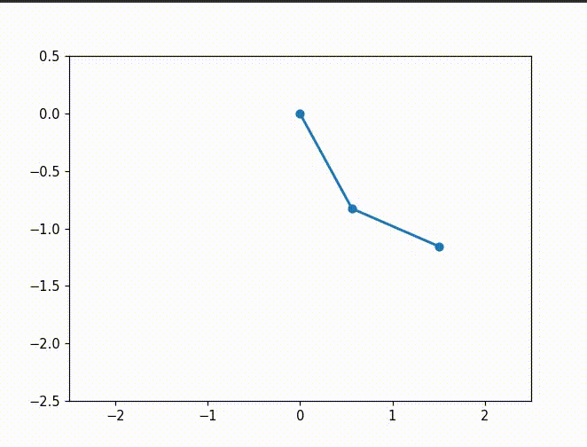
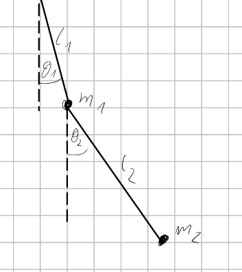

This project presents a numerical solution to a classical physics problem using Python.

Physics background:

To solve this problem we need to write a system of equations describing our pendulum, let's use $\theta_1$ and $\theta_2$ as our generalized coordinates. Now we can write the $XY$ coordinates of masses $m_1$ and $m_2$ using these angles:

$$
x_1 = l_1 \sin\theta_1, \quad y_1 = -l_1 \cos\theta_1
$$

$$
x_2 = x_1 + l_2 \sin\theta_2, \quad y_2 = y_1 - l_2 \cos\theta_2
$$

Lagrangian function is defined as $L = T - V$ where $T$ is kinetic energy and $V$ is potential energy. Those energies can be written in terms of $\theta_1$ and $\theta_2$ as:

$$
V = -(m_1 + m_2) g l_1 \cos\theta_1 - m_2 g l_2 \cos\theta_2
$$

$$
T = \frac{1}{2} (m_1 + m_2) l_1^2 \dot{\theta}_1^2 + \frac{1}{2} m_2 l_2^2 \dot{\theta}_2^2 + m_2 l_1 l_2 \dot{\theta}_1 \dot{\theta}_2 \cos(\theta_1 - \theta_2)
$$

**Lagrangian ($L$)**

$$
L = \frac{1}{2} (m_1 + m_2) l_1^2 \dot{\theta}_1^2 + \frac{1}{2} m_2 l_2^2 \dot{\theta}_2^2 + m_2 l_1 l_2 \dot{\theta}_1 \dot{\theta}_2 \cos(\theta_1 - \theta_2) + (m_1 + m_2) g l_1 \cos\theta_1 + m_2 g l_2 \cos\theta_2
$$

Let's write down Euler-Lagrange equations:

$$
\frac{d}{dt}\left(\frac{\partial L}{\partial \dot{\theta}_i}\right) - \frac{\partial L}{\partial \theta_i} = 0 \quad \text{for } i = 1, 2
$$

Now we have the system of second-order differential equations:

$$
\ddot{\theta}_1 = \frac{-g(2m_1 + m_2)\sin\theta_1 - m_2 g \sin(\theta_1 - 2\theta_2) - 2\sin(\theta_1-\theta_2)m_2(\dot{\theta}_2^2 l_2 + \dot{\theta}_1^2 l_1 \cos(\theta_1-\theta_2))}{l_1 (2m_1 + m_2 - m_2 \cos(2\theta_1 - 2\theta_2))}
$$

$$
\ddot{\theta}_2 = \frac{2\sin(\theta_1-\theta_2)(\dot{\theta}_1^2 l_1(m_1 + m_2) + g(m_1 + m_2)\cos\theta_1 + \dot{\theta}_2^2 l_2 m_2 \cos(\theta_1-\theta_2))}{l_2 (2m_1 + m_2 - m_2 \cos(2\theta_1 - 2\theta_2))}
$$

This system was reduced to a set of four first-order ordinary differential equations (state vector: $[\theta_1, \dot{\theta}_1, \theta_2, \dot{\theta}_2]$) and solved numerically using the `solve_ivp` algorithm from the SciPy library.
